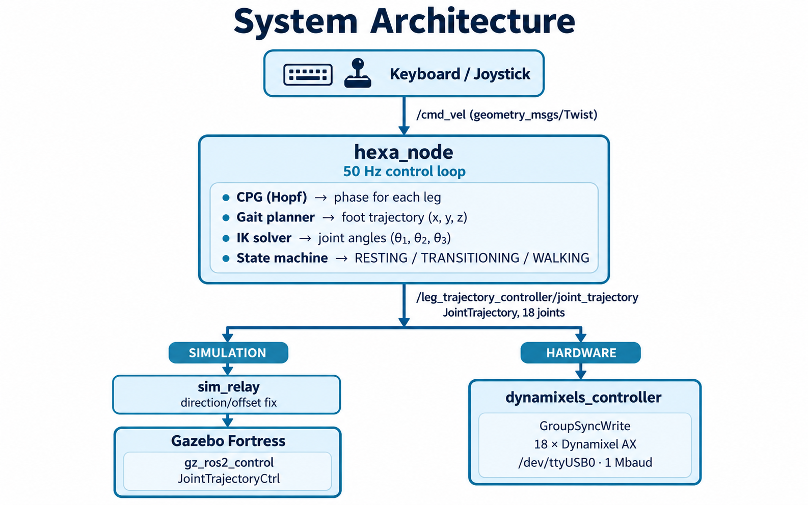
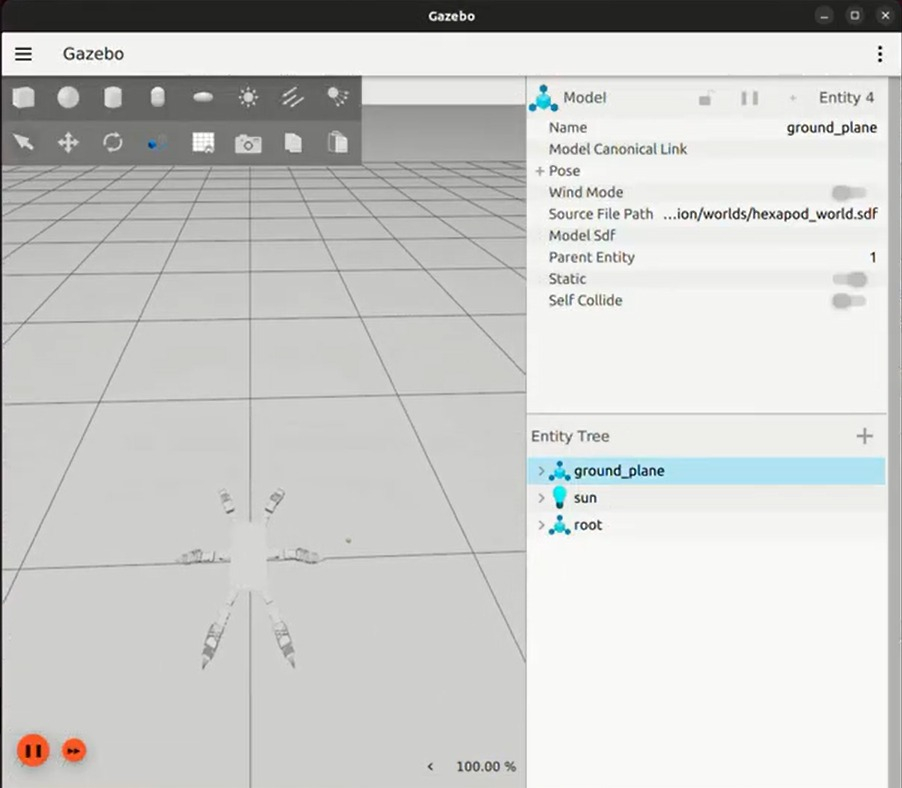
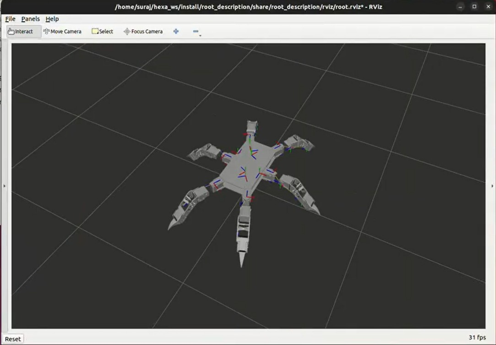
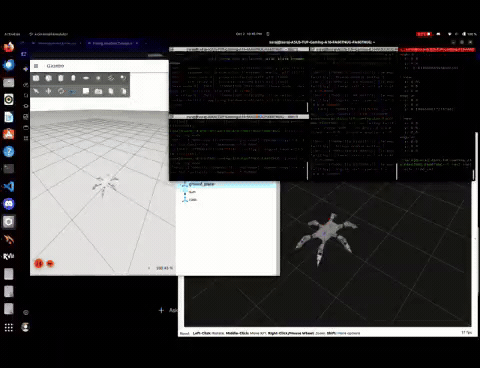

# Hexapod Robot — ROS 2 / Gazebo Fortress

A 6-legged (hexapod) robot built from scratch: custom 3D-printed links, Dynamixel AX-series servos, a hand-derived URDF, and a fully original CPG-based walking controller written in Python on ROS 2 Humble.

<!-- Add a photo or GIF of the robot here -->
<!--  -->

---

## Table of Contents

- [What I Built & Learned](#what-i-built--learned)
- [Repository Structure](#repository-structure)
- [System Architecture](#system-architecture)
- [Package Details](#package-details)
  - [hexa\_control](#hexa_control)
  - [root\_description](#root_description)
- [Robot Specifications](#robot-specifications)
- [Getting Started](#getting-started)
  - [Prerequisites](#prerequisites)
  - [Build](#build)
  - [Run in Simulation (Gazebo Fortress)](#run-in-simulation-gazebo-fortress)
  - [Run on Hardware](#run-on-hardware)
  - [URDF Viewer (RViz only)](#urdf-viewer-rviz-only)
- [Controlling the Robot](#controlling-the-robot)
- [Screenshots & Videos](#screenshots--videos)
- [Roadmap](#roadmap)

---

## What I Built & Learned

This project started from zero — no existing codebase, no pre-made libraries for the walking controller. Here is what I worked through end-to-end:

**Mechanical & URDF**
- Designed 6 identical leg assemblies, each with 3 revolute joints (coxa → femur → tibia), and assembled them symmetrically around a hexagonal base body.
- Wrote the entire URDF by hand as a modular xacro file, including inertial tensors, STL mesh references (scaled from mm to m), and ros2\_control hardware interfaces.
- Tuned joint limits to ±120° (2.094 rad), damping, and friction to match the physical Dynamixel AX behaviour.

**3-DOF Inverse & Forward Kinematics**
- Derived the analytical IK for the leg: coxa rotation (θ₁) from `atan2(y, x)`, then a 2-link planar IK in the vertical plane for femur (θ₂) and tibia (θ₃) using the law of cosines.
- Implemented zero-angle compensation (`femur_zero_angle = -35°`, `tibia_zero_angle = -60°`) to map from geometric angles to servo-relative angles.
- Also implemented forward kinematics for verification.

**CPG Gait Generator**
- Implemented a **Central Pattern Generator (CPG)** based on **Hopf oscillators** — the same class of bio-inspired controllers used in real legged-robot research.
- Each leg has its own oscillator; a **phase-bias coupling matrix** locks Tripod A (`FH_LH`, `MH_RH`, `BH_LH`) and Tripod B (`FH_RH`, `MH_LH`, `BH_RH`) 180° out of phase, producing a stable tripod gait automatically.
- The system of ODEs is integrated at 50 Hz using **4th-order Runge-Kutta (RK4)** for numerical stability.
- Stance and swing phases use separate angular velocities (controlled by `duty_factor = 0.70`) so stance is slower and swing is faster, like a real walking leg.
- Foot trajectories blend a planar ground-contact sweep with a raised swing arc, and the swing height is shaped by `sin^0.8` for a smooth, rounded step.

**ROS 2 Control Node**
- Built a full ROS 2 lifecycle-style node (`hexa_node`) with a clean **state machine**: `RESTING → TRANSITIONING → WALKING → TRANSITIONING → RESTING`.
- The robot auto-stands when a `/cmd_vel` command arrives, walks while commands are active, and gracefully returns to a folded rest pose after 5 s of idling.
- All state transitions interpolate joint angles smoothly over a configurable `transition_duration` so nothing snaps or jerks.
- On `Ctrl+C` / shutdown, `destroy_node()` drives the robot back to rest synchronously before closing, protecting the hardware.

**Dynamixel Hardware Driver**
- Wrote a low-level ROS 2 node that subscribes to the same `JointTrajectory` topic and drives 18 Dynamixel AX servos via **GroupSyncWrite** — one USB packet per control cycle instead of 18 individual writes, keeping latency low.
- Implemented the angle → raw-value conversion with per-joint direction and zero-offset correction so the same IK angles work identically on both hardware and simulation.

**Simulation Bridge**
- Because Gazebo joint directions differ from physical servo directions, I wrote a lightweight `sim_relay` node that intercepts the trajectory, applies per-joint direction and offset corrections, and republis`hes — keeping `hexa_node` hardware-agnostic.

**Gazebo Fortress Integration**
- Integrated `gz_ros2_control` so the simulated robot is driven by the same `JointTrajectoryController` as the real one.
- Set up `ros_gz_bridge` for `/clock`, `/tf`, and `/odom` bridging.
- Tuned the controller YAML for **open-loop mode** — necessary because `hexa_node` streams 1-point trajectories at 50 Hz and closed-loop would keep aborting goals mid-execution.

---

## Repository Structure

```
Hexapod/
├── hexa_control/          # ROS 2 Python package — walking controller + hardware driver
│   ├── hexa_control/
│   │   ├── hexa_node.py            # Main control node (CPG + IK + state machine)
│   │   ├── gait.py                 # CPG Hopf oscillator gait generator
│   │   ├── kinematics.py           # Analytical 3-DOF IK / FK
│   │   ├── dynamixels_controller.py# Dynamixel AX hardware driver node
│   │   └── sim_relay.py            # Simulation direction-correction bridge
│   ├── setup.py
│   └── package.xml
│
└── root_description/      # ROS 2 CMake package — URDF, meshes, launch, config
    ├── urdf/
    │   ├── root.xacro              # Main robot URDF (all links & joints)
    │   ├── root.ros2_control.xacro # ros2_control hardware interface
    │   ├── root.gazebo.xacro       # Gazebo-specific plugins
    │   └── materials.xacro         # Visual materials
    ├── meshes/                     # STL files for all robot links
    ├── launch/
    │   ├── gz_sim.launch.py        # Full Gazebo Fortress + controller + hexa_node
    │   └── display.launch.py       # RViz + joint_state_publisher_gui (no sim)
    ├── config/
    │   └── controllers.yaml        # ros2_control controller config (100 Hz)
    ├── worlds/
    │   └── hexapod_world.sdf       # Custom Gazebo world
    └── rviz/
        └── root.rviz               # RViz configuration
```

---

## System Architecture



---

## Package Details

### hexa_control

| File | Purpose |
|---|---|
| `hexa_node.py` | Main ROS 2 node. 50 Hz timer, state machine, integrates CPG + IK, publishes `JointTrajectory`. |
| `gait.py` | `CpgGait` class. Hopf oscillator per leg, RK4 integration, tripod phase coupling, foot trajectory. |
| `kinematics.py` | `Kinematics` class. Analytical IK (`theta1`, `theta2`, `theta3`) and FK. |
| `dynamixels_controller.py` | `DynamixelDriverNode`. Subscribes to `JointTrajectory`, converts angles to raw Dynamixel positions, SyncWrite at 1 Mbaud. |
| `sim_relay.py` | `SimRelayNode`. Translates `hexa_node` output to simulator joint conventions (direction flip + offsets). |

**ROS 2 entry points (from `setup.py`):**

```
hexa_node          → hexa_control.hexa_node:main
dynamixels_driver  → hexa_control.dynamixels_controller:main
sim_relay          → hexa_control.sim_relay:main
```

**Key parameters (hexa_node):**

| Parameter | Default | Description |
|---|---|---|
| `control_rate_hz` | `50.0` | Control loop frequency |
| `gait_frequency` | `0.5` | CPG oscillation frequency (Hz) |
| `step_height` | `0.06` | Swing phase foot lift (m) |
| `stance_reach_x` | `0.160` | Default foot forward reach (m) |
| `standing_height` | `-0.190` | Body height above ground (m) |
| `transition_duration_sec` | `1.5` | Sit/stand interpolation time (s) |
| `idle_to_rest_sec` | `5.0` | Idle timeout before sitting (s) |

---

### root_description

| File/Dir | Purpose |
|---|---|
| `urdf/root.xacro` | Full robot URDF: `base_link`, 6 Dynamixel mounts, 6 × 3 leg links, all joints |
| `urdf/root.ros2_control.xacro` | Hardware interface declaration for `gz_ros2_control` |
| `urdf/root.gazebo.xacro` | Gazebo Fortress plugin (`gz_ros2_control`) |
| `config/controllers.yaml` | `JointTrajectoryController` for 18 joints, 100 Hz, open-loop |
| `launch/gz_sim.launch.py` | Full sim launch: Gazebo + RSP + spawn + bridge + controllers + hexa_node + sim_relay |
| `launch/display.launch.py` | URDF viewer: RSP + joint_state_publisher_gui + RViz |
| `meshes/` | STL meshes for base, Dynamixel brackets, femur, tibia links |
| `worlds/hexapod_world.sdf` | Flat-ground Gazebo world |

---

## Robot Specifications

| Property | Value |
|---|---|
| Legs | 6 (hexapod) |
| DOF per leg | 3 (coxa, femur, tibia) |
| Total joints | 18 |
| Actuators | Dynamixel AX series (protocol 1.0) |
| Coxa length (l1) | 51 mm |
| Femur length (l2) | 110 mm |
| Tibia length (l3) | 148 mm |
| Body mass (URDF) | ~0.90 kg |
| Gait type | Tripod (CPG Hopf oscillator) |
| Control frequency | 50 Hz |
| Communication | USB-to-TTL @ 1 Mbaud |

**Leg naming convention:**

```
FH = Front Hex   MH = Middle Hex   BH = Back Hex
LH = Left Half   RH = Right Half

      FH_LH ── FH_RH
     /               \
   MH_LH           MH_RH
     \               /
      BH_LH ── BH_RH
```

**Tripod groups:**
- **Tripod A** (swing together): `FH_LH`, `MH_RH`, `BH_LH`
- **Tripod B** (swing together): `FH_RH`, `MH_LH`, `BH_RH`

---

## Getting Started

### Prerequisites

- **ROS 2 Humble** (Ubuntu 22.04)
- **Gazebo Fortress** with `ros_gz_sim`, `ros_gz_bridge`, `gz_ros2_control`
- **ros2_control** stack: `controller_manager`, `joint_state_broadcaster`, `joint_trajectory_controller`
- Python: `numpy` (for gait CPG) , `rclpy`
- Hardware only: `dynamixel_sdk` Python package

```bash
# ROS 2 Humble + Gazebo Fortress meta-packages
sudo apt install ros-humble-ros-gz ros-humble-gz-ros2-control \
     ros-humble-ros2-control ros-humble-ros2-controllers \
     ros-humble-xacro ros-humble-joint-state-publisher-gui

# Python deps
pip install numpy dynamixel-sdk
```

### Build

```bash
cd ~/hexa_ws          # or wherever you cloned this
colcon build --symlink-install
source install/setup.bash
```

### Run in Simulation (Gazebo Fortress)

```bash
source install/setup.bash
ros2 launch root_description gz_sim.launch.py
OR 
bash /home/suraj/hexa_ws/run_sim.sh
```

This starts: Gazebo Fortress → spawns the robot → loads ros2_control controllers → starts `hexa_node` + `sim_relay`.

Send velocity commands to make it walk:

```bash
# Forward
ros2 topic pub --once /cmd_vel geometry_msgs/msg/Twist \
  "{linear: {x: 0.05, y: 0.0, z: 0.0}, angular: {z: 0.0}}"

# Turn in place
ros2 topic pub --once /cmd_vel geometry_msgs/msg/Twist \
  "{linear: {x: 0.0, y: 0.0, z: 0.0}, angular: {z: 0.3}}"

# Stop (robot will auto-sit after 5 s)
ros2 topic pub --once /cmd_vel geometry_msgs/msg/Twist \
  "{linear: {x: 0.0}, angular: {z: 0.0}}"
```

### Run on Hardware

Connect the Dynamixel U2D2 (or USB-to-TTL adapter) and run:

```bash
source install/setup.bash

# Terminal 1 — main controller
ros2 run hexa_control hexa_node

# Terminal 2 — hardware driver
ros2 run hexa_control dynamixels_driver \
  --ros-args -p device:=/dev/ttyUSB0 -p baudrate:=1000000

# Terminal 3 - control method
source ~/hexa_ws/install/setup.bash
ros2 run teleop_twist_keyboard teleop_twist_keyboard    #For keyboard teleop
                OR
ros2 run teleop_twist_joy teleop_node --ros-args -p scale_linear.x:=0.05 -p scale_angular.z:=0.05   #For controller teleop
ros2 run joy joy_node
```

> Make sure your user is in the `dialout` group: `sudo usermod -aG dialout $USER`

### URDF Viewer (RViz only)

```bash
ros2 launch root_description display.launch.py
```

Drag the sliders in `joint_state_publisher_gui` to manually pose each leg.

---

## Controlling the Robot

The robot reacts to `geometry_msgs/Twist` on `/cmd_vel`:

| Field | Effect |
|---|---|
| `linear.x` | Forward / backward walking |
| `linear.y` | Strafing left / right |
| `angular.z` | Turning / rotating in place |

You can also use `teleop_twist_keyboard`:

```bash
ros2 run teleop_twist_keyboard teleop_twist_keyboard
```
or else use `teleop_twist_joy`:

```bash
ros2 run teleop_twist_joy teleop_node --ros-args -p scale_linear.x:=0.05 -p scale_angular.z:=0.05
ros2 run joy joy_node
```
---

## Screenshots & Videos

<!-- Add your screenshots and videos here once you have them -->

### Gazebo Fortress simulation


### Physical robot


---

## Future Roadmap

- [ ] IMU-based body levelling
- [ ] Terrain-adaptive foot force estimation
- [ ] Navigation stack integration (Nav2 + LiDAR)
- [ ] Faster gait modes (wave, ripple)
- [ ] GUI parameter tuner for CPG gains
